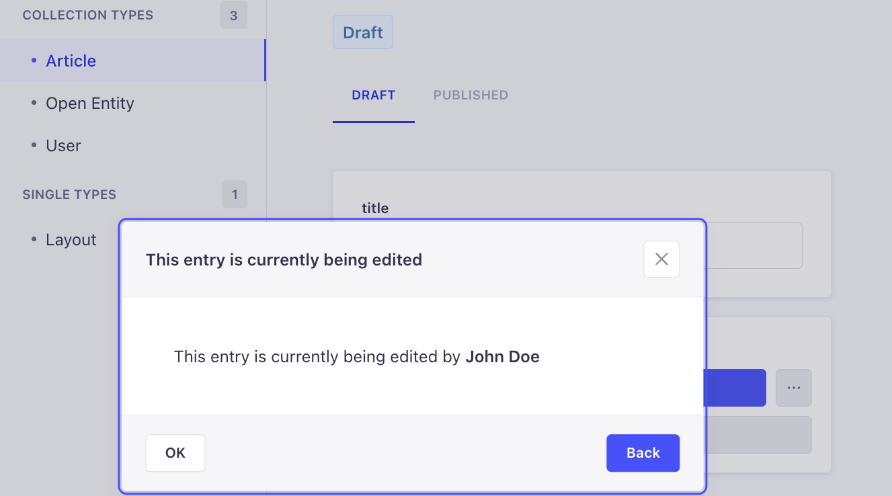
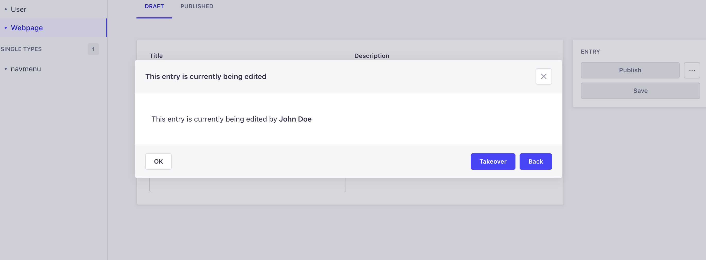

# Strapi plugin record-locking

This plugin provides the functionality to prevent data loss in cases where multiple users are simultaneously editing the same record within STRAPI v5.

**When a user attempts to edit a record that is already being edited, a warning will be displayed.**



## ⚠️ We've released version 2.0.0 for the Record Locking Plugin.

Plugin version 2.x is aimed at Strapi V5. If you need support for Strapi V4, please follow the 1.x releases. What's new:

- TypeScript rewrite.
- Overall code refactor to make it safer & more readable.
- Strapi V5 support.
  - Records are now matched based on `document_id` attribute.

### Migration from 1.x to 2.x

Since the plugin does not retain any data, we're not providing migration scripts for the database. Strapi should update the columns automatically, however if this does not happen, you can update the columns manually when migrating to Strapi V5:

- column `entityType` has been renamed to `entityId`
- column `entityIdentifier` has been renamed to `entityDocumentId`

## 🙉 What does the plugin do for you?

✅ Safeguards against concurrent editing by restricting access to a record to a single user at a time.

✅ Provides clear visibility of the current editing user, enabling you to easily identify who is working on the record.

## 🧑‍💻 Installation

### 1. Install the plugin with your favourite package manager:

```
npm i @notum-cz/strapi-plugin-record-locking
```

```
yarn add @notum-cz/strapi-plugin-record-locking
```

### 2. Create or modify file `config/plugins.js` and include the following code snippet:

```js
module.exports = ({ env }) => ({
  'record-locking': {
    enabled: true,
  },
});
```

We use websockets and you can determine the necessary transport yourself:

```js
module.exports = ({ env }) => ({
  'record-locking': {
    enabled: true,
    config: {
      transports: ['websocket'],
    },
  },
});
```

If you do not specify a transport, the default parameters will be applied:

```js
DEFAULT_TRANSPORTS: ['polling', 'websocket', 'webtransport'];
```

### 3. Enable websocket support by configuring the Strapi middleware.

In the `config/middlewares.js` file either replace `'strapi::security'` with a middleware object (see the example below) or update your existing configuration accordingly.

1. Ensure that `contentSecurityPolicy.directives.connect-src` array includes `"ws:"` and `"wss:"`.
2. Rebuild Strapi and test record locking features.
3. You should not encounter any `Content Security Policy` errors in the console.

```js
module.exports = [
  'strapi::errors',
  {
    name: "strapi::security",
    config: {
      contentSecurityPolicy: {
        useDefaults: true,
        directives: {
          "connect-src": ["'self'", "https:", "ws:", "wss:", "http:"],
          "img-src": [
            "'self'",
            "data:",
            "blob:",
          ],
          "media-src": ["'self'", "data:", "blob:"],
          upgradeInsecureRequests: null,
        },
      },
    },
  },
  'strapi::cors', ...
```

> While optional, it is highly **recommended** to implement this step to prevent Socket.io from falling back to the HTTP protocol and generating the following error in the web console.  
> `Refused to connect to <protocol>://<url> because it does not appear in the connect-src directive of the Content Security Policy`

---

### 3. Enable the takeover feature.
In the `config/plugin.ts`, enable the `Takeover` button via the following configuration change (this button is disabled by default):

```
module.exports = ({ env }) => ({
  'record-locking': {
    enabled: true,
    config: {
      showTakeoverButton: true,
    },
  },
});
```
- Once this configuration is enabled, the modal that specifies that an entry is being edited by another user will have a `Takeover` button.



- Clicking this button will change the record lock to the user taking over.
- The user previously editing will see a modal with a message that the entry has been taken over.


## 🛣️ Road map

Are any of these features significant to you? Please show your support by giving a thumbs up on the linked issues. This will help us assess their priority on the roadmap.

- ✨ [An option to select specific collection types](https://github.com/notum-cz/strapi-plugin-record-locking/issues/46)

## 🐛 Bugs

We manage bugs through [GitHub Issues](https://github.com/notum-cz/strapi-plugin-record-locking/issues). <br>
If you're interested in helping us, you would be a rock ⭐.

## 🧔 Authors

The main star: **Martin Čapek** https://github.com/martincapek <br>
Original Maintainer: **Ondřej Mikulčík** https://github.com/omikulcik <br>
Active Maintainer: **Dominik Juriga** https://github.com/dominik-juriga <br>
Project owner: **Ondřej Janošík** <br>

## 💬 Community

Join our [Discord server](https://discord.gg/hZRCcfWq) to discuss new features, implementation challenges or anything related to this plugin.

### 🚀 Created with passion by [Notum Technologies](https://notum.cz/en)

- Official STRAPI partner and Czech based custom development agency.
- We're passionate about sharing our expertise with the open source community, which is why we developed this plugin. 🖤

### 🎯 [How can Notum help you with your STRAPI project?](https://notum.cz/en/strapi/)

✔️ We offer valuable assistance in developing custom STRAPI, web, and mobile apps to fulfill your requirements and goals.. <br>
✔️ With a track record of 100+ projects, our open communication and exceptional project management skills provide us with the necessary tools to get your project across the finish line.<br>
📅 To initiate a discussion about your Strapi project, feel free to reach out to us via email at sales@notum.cz. We're here to assist you!

## 🔑 Keywords

- [strapi](https://www.npmjs.com/search?q=keywords:strapi)
- [plugin](https://www.npmjs.com/search?q=keywords:plugin)
- [record](https://www.npmjs.com/search?q=keywords:record)
- [lock](https://www.npmjs.com/search?q=keywords:lock)
