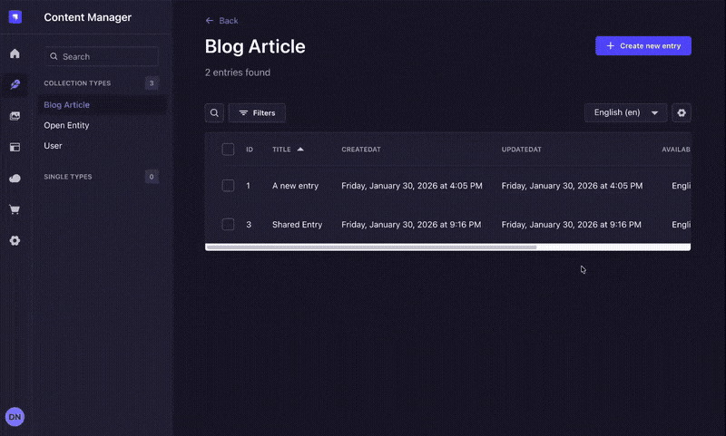
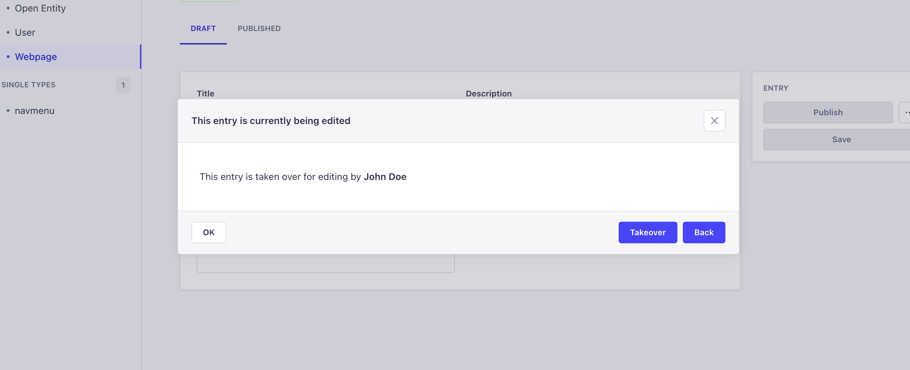

<div align="center">

  <picture >
  <!-- User has no color preference: -->
  
</picture>
  <h1>Record Locking Plugin for Strapi</h1>
  
  <p>
Avoid concurrent edits on the same record in Strapi. Notify users when a record is being edited by another user, with an optional takeover feature.
  </p>
  
  
<!-- Badges -->
<p>
  <a href="https://github.com/notum-cz/strapi-plugin-record-locking/graphs/contributors">
    
  </a>
  <a href="">
    
  </a>
  <a href="https://github.com/notum-cz/strapi-plugin-record-locking/issues/">
    
  </a>
  <a href="https://github.com/notum-cz/strapi-plugin-record-locking/blob/master/LICENSE">
    
  </a>
</p>
   
<h4>
    <a href="https://github.com/notum-cz/strapi-plugin-record-locking/issues/">Report Bug or Request Feature</a>
  
  </h4>
</div>

<br />

<!-- Table of Contents -->

# Table of Contents

- [Table of Contents](#table-of-contents)
  - [About the Project](#about-the-project)
    - [Features](#features)
    - [Screenshots](#screenshots)
    - [Supported Versions](#supported-versions)
      - [Strapi V5.x.x](#strapi-v5xx)
      - [Strapi V4.x.x](#strapi-v4xx)
  - [Getting Started](#getting-started)
    - [Installation](#installation)
      - [1. Install the plugin via npm or yarn](#1-install-the-plugin-via-npm-or-yarn)
      - [2. Enable the plugin in your Strapi `config/plugins.[js|ts]` file](#2-enable-the-plugin-in-your-strapi-configpluginsjsts-file)
      - [3. Update Strapi middleware to enable websocket communication](#3-update-strapi-middleware-to-enable-websocket-communication)
      - [4. Rebuild Strapi and test the plugin](#4-rebuild-strapi-and-test-the-plugin)
    - [Plugin Configuration](#plugin-configuration)
      - [`transports`](#transports)
      - [`showTakeoverButton`](#showtakeoverbutton)
      - [`include` and `exclude` options](#include-and-exclude-options)
  - [Roadmap](#roadmap)
  - [Community](#community)
    - [This plugin is maintained by Notum Technologies, a Czech-based Strapi Enterprise Partner.](#this-plugin-is-maintained-by-notum-technologies-a-czech-based-strapi-enterprise-partner)
      - [Current maintainer](#current-maintainer)
      - [Contributors](#contributors)
    - [How can Notum help you with your STRAPI project?](#how-can-notum-help-you-with-your-strapi-project)
    - [Contributing](#contributing)

<!-- About the Project -->

## About the Project

<!-- Features -->

### Features

- Let users know when a record is being edited by another user
- Prevent concurrent edits on the same record
- Takeover an entry being edited by another user (optional)

<!-- Screenshots -->

### Screenshots

<div align="center"> 
  
</div>

<!-- Supported Versions -->

### Supported Versions

This plugin is compatible with Strapi `v5.x.x` and Strapi `v4.x.x`.

#### Strapi V5.x.x

This is the primary and recommended version of Strapi. If using Strapi V5, use `2.x.x` versions of this plugin. The latest plugin version has been tested with Strapi `v5.34.0`.

#### Strapi V4.x.x

If you are using Strapi V4, please use the `1.x.x` versions of this plugin. Note that Strapi V4 has reached its end of life and is no longer actively maintained.

We will continue providing critical bug fixes through community contributions, but new features and improvements will be focused on Strapi V5.

<!-- Getting Started -->

## Getting Started

<!-- Installation -->

### Installation

#### 1. Install the plugin via npm or yarn

```bash
# NPM
npm i @notum-cz/strapi-plugin-record-locking

# Yarn
yarn add @notum-cz/strapi-plugin-record-locking

```

#### 2. Enable the plugin in your Strapi `config/plugins.[js|ts]` file

```typescript
// config/plugins.ts
export default () => ({
  // -- your other plugins configs --

  'record-locking': {
    enabled: true,
  },
});
```

#### 3. Update Strapi middleware to enable websocket communication

If you are using websockets for real-time communication, you will need to update Strapi's `security` middleware. Update your `config/middlewares.[js|ts]`:

```typescript
export default [
  'strapi::logger',
  'strapi::errors',
  // Replace `strapi::security` entry with the following configuration:
  // ---- security middleware start ----
  {
    name: 'strapi::security',
    config: {
      contentSecurityPolicy: {
        useDefaults: true,
        directives: {
          'connect-src': ["'self'", 'https:', 'ws:', 'wss:', 'http:'], // update with your preferred transport
          'img-src': ["'self'", 'data:', 'blob:'],
          'media-src': ["'self'", 'data:', 'blob:'],
          upgradeInsecureRequests: null,
        },
      },
    },
  },
  // ---- security middleware end ----
  'strapi::cors',
  'strapi::poweredBy',
  'strapi::query',
  'strapi::body',
  'strapi::session',
  'strapi::favicon',
  'strapi::public',
];
```

> While optional, it is highly **recommended** to implement this step to prevent Socket.io from falling back to the HTTP protocol and generating the following error in the web console.
>
> `Refused to connect to <protocol>://<url> because it does not appear in the connect-src directive of the Content Security Policy`

#### 4. Rebuild Strapi and test the plugin

```bash
  yarn build
  yarn start
```

### Plugin Configuration

This plugin has an optional `config` attribute. Below are the available configuration options:

#### `transports`

Array of transport methods for real-time communication. Defaults to `['polling', 'websocket', 'webtransport']` (see [transports.ts](./server/src/constants/transports.ts)).

Example:

```typescript
export default () => ({
  // -- your other plugins configs --

  'record-locking': {
    enabled: true,
    config: {
      transports: ['websocket'],
    },
  },
});
```

#### `showTakeoverButton`

Boolean to show or hide the takeover button in the UI. Defaults to `false`.

If enabled, the notification dialog will include a "Takeover" button, allowing users to forcibly take over the record being edited by another user.


Clicking the button will change the lock ownership. The user who was previously editing the record will be notified that they have lost the lock.


Example:

```typescript
export default () => ({
  // -- your other plugins configs --

  'record-locking': {
    enabled: true,
    config: {
      showTakeoverButton: true,
    },
  },
});
```

#### `include` and `exclude` options

This plugin allows you to specify which content types should have record locking enabled or disabled using `include` and `exclude` options. All content types have record locking enabled by default.

- `include`: An array of content type UIDs to enable record locking for. If specified, only these content types will have record locking enabled.
- `exclude`: An array of content type UIDs to disable record locking for. If specified, these content types will not have record locking enabled.

> [!IMPORTANT]
> These options are mutually exclusive. You can only use one of them at a time. If you specify both, the `include` option will take precedence and the `exclude` option will be **ignored**.

Example:

```typescript
export default () => ({
  // -- your other plugins configs --

  'record-locking': {
    enabled: true,
    config: {
      include: ['api::article.article', 'api::blog.blog'], // only these content types will have record locking enabled
      // exclude: ['plugin::users-permissions.user'] // this option will be ignored if `include` is specified
    },
  },
});
```

<!-- Roadmap -->

## Roadmap

We're currently revising the roadmap for this plugin. Stay tuned for updates!

<!-- Contributing -->

## Community

### This plugin is maintained by [Notum Technologies](https://notum.tech), a Czech-based Strapi Enterprise Partner.

We're a software agency specializing in custom solutions based on Strapi. We're passionate about sharing our expertise with the open-source community.

This plugin is overseen by Ondřej Jánošík and it has been originally developed by [Martin Čapek](https://github.com/martincapek).

#### Current maintainer

[Dominik Juriga](https://github.com/dominik-juriga)

#### Contributors

This plugin has been brought to you thanks to the following contributors:

<a href="https://github.com/notum-cz/strapi-plugin-record-locking/graphs/contributors">
  
</a>

### [How can Notum help you with your STRAPI project?](https://www.notum.tech/notum-and-strapi)

✔️ We offer valuable assistance in developing custom STRAPI, web, and mobile apps to fulfill your requirements and goals.. <br>
✔️ With a track record of 100+ projects, our open communication and exceptional project management skills provide us with the necessary tools to get your project across the finish line.<br>

To initiate a discussion about your Strapi project, feel free to reach out to us via email at sales@notum.cz. We're here to assist you!

### Contributing

Contributions are always welcome! Please follow these steps to contribute:

1. Fork the Project
2. Create your Feature Branch (`git checkout -b feature/AmazingFeature`)
3. Commit your Changes (`git commit -m 'Add some AmazingFeature'`)
4. Push to the Branch (`git push origin feature/AmazingFeature`)
5. Open a Pull Request
